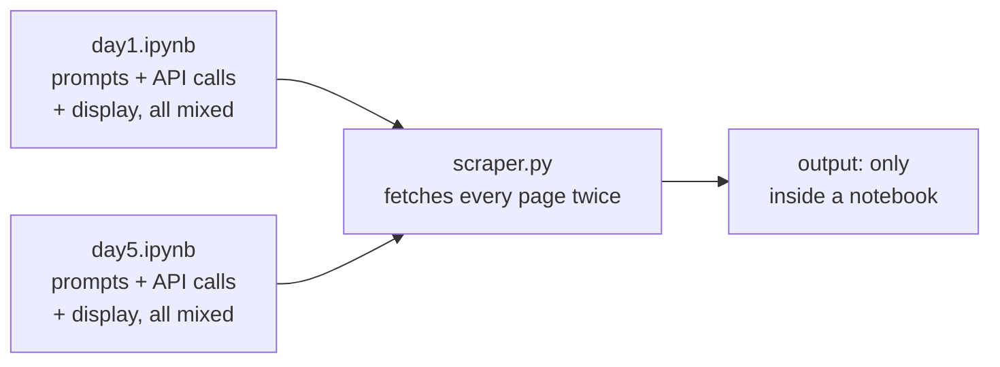
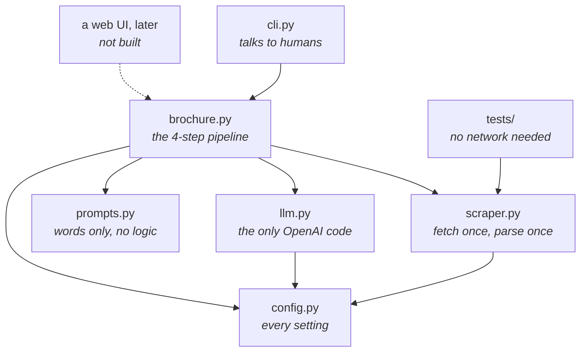

# Brochure Generator

Point it at a company's website. It reads the site, works out which pages
matter, and writes a brochure.

```bash
python -m src.cli brochure "HuggingFace" https://huggingface.co
```

---

## The problem

Writing a one-page summary of a company is a job that happens constantly and
that nobody enjoys. A salesperson researching an account before a call. A
recruiter writing the intro paragraph of a job ad. An analyst building a list
of twenty competitors. A candidate trying to work out what a company actually
does before an interview.

The work is always the same shape: open the site, click into About, skim
Careers, skim Customers, ignore the cookie banner and the privacy policy, and
turn what you found into a few readable paragraphs. It takes ten to fifteen
minutes per company and the result is mostly forgettable.

The interesting part is that this is not one task, it is two. There is a
**judgement** task, deciding which of the hundred links on a homepage are
worth reading, and there is a **writing** task, turning those pages into
prose. Most attempts at automating this treat it as a single step: scrape
everything, throw it at a model, hope. That is slow, expensive, and produces
worse results, because the model spends its attention on navigation menus and
legal boilerplate.

This project separates the two steps. That single decision is what makes it
cheap and what makes the output decent.

---

## What it does

```
python -m src.cli brochure "HuggingFace" https://huggingface.co
```

1. **Fetches the landing page** and pulls out every link on it.
2. **Asks a small model which links matter.** About, Careers, Customers, and
   Products get through. Terms of Service, Privacy, and social media links do
   not. The reply comes back as structured JSON.
3. **Fetches only those pages** and stitches the text together, trimmed to a
   budget.
4. **Asks a better model to write the brochure**, streamed to your terminal so
   you see words appear immediately.

There is a second, simpler command for when you just want to know what a
single page says:

```bash
python -m src.cli summarize https://anthropic.com
```

### Options

| Flag | What it does |
|---|---|
| `--funny` | Switches to an irreverent tone instead of the straight one |
| `-o out.md` | Saves the brochure to a file as well as printing it |
| `--no-stream` | Waits for the complete reply instead of streaming |

### Sample output

Real output from `python -m src.cli brochure "Anthropic" https://anthropic.com`,
generated in about 30 seconds for roughly a fifth of a cent.

<details>
<summary>Click to expand the generated brochure</summary>

> # Anthropic Brochure
>
> ## Who We Are
>
> Anthropic is a public benefit corporation focused on AI safety and research.
> We are dedicated to building AI systems that people can rely on by ensuring
> they are safe, interpretable, and steerable. With AI's vast potential impact
> on the world, we commit to securing its benefits while mitigating risks.
>
> ## What We Do
>
> - **AI Research and Safety:** We tackle the hardest questions about AI across
>   safety, governance, and societal and economic impacts.
> - **Frontier AI Systems:** We develop advanced AI models such as Opus 5,
>   which represents a significant leap in coding capability, agent
>   sophistication, and professional application performance.
> - **Systematic Safety Science:** Our approach treats AI safety as a rigorous
>   scientific discipline. We conduct cutting-edge research, integrate findings
>   into our products, and share our insights transparently.
> - **Product Deployment:** Our technologies are brought to users through
>   partnerships and practical products, including the Claude family of AI
>   models and related applications.
>
> ## Our Culture and Mission
>
> - **Built on Hard Questions:** Anthropic thrives on addressing the
>   challenging and complex questions surrounding AI's safe development and
>   deployment.
> - **Public Benefit Focus:** As a public benefit corporation, we align our
>   goals with positive societal impact rather than solely commercial
>   interests.
> - **Transparency and Collaboration:** We maintain an open approach to
>   research and policy, actively sharing knowledge to foster trust and
>   responsible AI innovation.
>
> ## Our Customers
>
> Anthropic serves organizations and developers who require AI systems that are
> not only powerful but also reliable and safe for real-world applications.
>
> ## Join Our Team
>
> We are growing and looking for talented individuals passionate about AI
> safety, research, and engineering.

</details>

Worth noticing what the model did here. It never saw a page called "Our
Culture" or "Our Customers"; it inferred those sections from the About and
Careers pages that step 2 selected. That is the two-step design paying off. A
single-shot scrape of the whole site would have spent most of its input budget
on navigation and footers instead.

Worth noticing what it got wrong, too. Details like model names and version
numbers come from whatever the site said on the day it was scraped, and the
model will happily state them with more confidence than they deserve. Check
anything factual before you put a brochure in front of someone.

---

## Product thinking

A few decisions worth explaining, because they were choices rather than
accidents.

**Two models, not one.** Choosing links from a list is mechanical work. It
needs no style and no reasoning to speak of, so it runs on the cheapest model
available. Writing the brochure is the part a human reads and judges, so it
gets a better one. Using one expensive model for both steps would have cost
several times more for no visible gain. This pattern, cheap model for
routing, expensive model for output, is worth internalising early. It applies
to almost every LLM product.

**Truncation is a product decision, not a technical one.** The caps in
`config.py` (2,000 characters per page, 5,000 total) exist because the tenth
paragraph of an About page almost never changes the brochure, but you pay for
it every single time. The limits are in one file precisely so you can raise
them when you decide the extra quality is worth the extra cost.

**Streaming, because waiting feels broken.** Streaming does not make the
request faster. It makes the wait *legible*. Twenty seconds of blank terminal
feels like a crash; twenty seconds of text appearing feels like work being
done. Same latency, completely different experience.

**Failures should be survivable.** Company sites have dead links. If one of
the five pages 404s, you still get a brochure built from the other four, plus
a note about what failed. An automation that gives up entirely because one
link rotted is an automation nobody uses twice.

**The model is not trusted.** It is told to reply in JSON, the API is
configured to enforce that, and the result is still checked for shape before
anything is done with it. Treat model output like input from a stranger,
because that is what it is.

### Deliberately not built

Scope discipline matters more than feature count on a first project.

- No web UI. The logic does not know how it is being called, so adding one
  later means writing one new file.
- No caching or database. Worth adding if you start running the same company
  twice; pointless before then.
- No batch mode for processing a CSV of companies. This is the most obvious
  next step and the one I would build first.

---

## Architecture

### The old way

The original was a Jupyter notebook: cells run top to bottom, prompts and API
calls and display code interleaved, state living in the notebook's memory.
That is the right shape for teaching, and the wrong shape for software. You
cannot test it, you cannot run it on a schedule, you cannot import a piece of
it, and changing the model name means finding all three places it was typed.



### This way



Each file has one job, so each change has one home.

| If you want to... | You open |
|---|---|
| Change the brochure's tone | `prompts.py` |
| Switch to Claude, Gemini, or a local model | `llm.py` |
| Use a cheaper model or allow longer pages | `config.py` |
| Handle a site that blocks scrapers | `scraper.py` |
| Add a web interface | a new file next to `cli.py` |

### What actually changed in the code

| | Notebook | Here |
|---|---|---|
| HTTP requests | Every page fetched twice, once for text and once for links | Fetched once, parsed once, both results reused |
| Relative links | `/careers` passed to `requests` unchanged, so it failed | Resolved to full URLs with `urljoin` |
| Duplicate links | `/about` and `/about#team` fetched as two pages | Deduplicated to one |
| A dead link | Crashes the run | Skipped with a warning, run continues |
| Model names | Typed into three separate cells | One line in `config.py` |
| Output | `display(Markdown(...))`, Jupyter only | Plain strings; terminal, file, or anything else |
| Tests | None possible | Nine, running offline in under a second |

The two-fetch problem was flagged in a comment in the original with an
invitation to fix it. This is that fix.

---

## Cost

The reason the two-step design matters, in numbers.

A brochure makes exactly two API calls:

| Step | Model | Rough tokens | Cost |
|---|---|---|---|
| Choosing links | `gpt-4.1-nano` | ~1,200 in / ~120 out | ~$0.0002 |
| Writing the brochure | `gpt-4.1-mini` | ~1,350 in / ~600 out | ~$0.0015 |
| **Total** | | | **~$0.002** |

About **500 brochures per dollar.**

Compare that to the obvious naive approach, scraping the whole site untrimmed
and sending it to a flagship model:

| | This design | Scrape everything, flagship model |
|---|---|---|
| Pages fetched | Landing + up to 5 chosen | Everything linked, often 20+ |
| Tokens sent | ~2,500 | ~10,000+ |
| Cost per brochure | ~$0.002 | ~$0.07 |
| Brochures per dollar | ~500 | ~15 |

Roughly **35x cheaper**, and the output is better, because the model is
reading About and Careers instead of the cookie policy.

Prices are as of August 2026 and change often. Check
[OpenAI's pricing page](https://openai.com/api/pricing/) for current rates,
and treat the token counts above as estimates. What holds regardless of price
changes is the ratio: the cheap model handles the bulk of the input, the
expensive one handles only the part that needs it.

### Levers if you need it cheaper still

- **Lower the caps** in `config.py`. Cost scales almost linearly with them.
- **Fetch fewer pages.** `MAX_LINKED_PAGES` is the single biggest dial.
- **Cache scraped pages** so re-running a company costs one API call, not two.
- **Use the Batch API** for bulk runs. Half price if you can wait.

---

## Getting started

You need Python 3.10 or newer and an OpenAI API key.

On Windows the command is usually `python`; on Mac and Linux it is `python3`.
Use whichever works on your machine, consistently.

**1. Get the code**

```bash
git clone https://github.com/YOUR-USERNAME/brochure-generator.git
cd brochure-generator
```

**2. Check your Python version**

```bash
python3 --version
```

Anything from 3.10 up is fine.

**3. Create a virtual environment**

```bash
python3 -m venv .venv
source .venv/bin/activate        # Windows: .venv\Scripts\activate
```

This keeps the project's libraries separate from the rest of your system.
Your prompt should now begin with `(.venv)`. You need to run the activate
line again in every new terminal session.

**4. Install dependencies**

```bash
pip install -r requirements.txt
```

**5. Add your API key**

```bash
cp .env.example .env             # Windows: copy .env.example .env
```

Open `.env` and replace the placeholder with your real key from
[platform.openai.com/api-keys](https://platform.openai.com/api-keys). No
quotes, no spaces around the `=`:

```
OPENAI_API_KEY=sk-proj-your-actual-key
```

**6. Run the tests**

```bash
pytest
```

You should see `9 passed`. These need no key and no internet, so a failure
here points at the install rather than at your key.

**7. Run it**

```bash
python -m src.cli brochure "HuggingFace" https://huggingface.co
```

It reads the landing page, reports how many links it found, lists the pages it
picked, then streams the brochure. Expect 20 to 40 seconds and about a fifth
of a cent.

### If something goes wrong

| Message | Cause |
|---|---|
| `No module named src` | Wrong folder. Be in `brochure-generator`, the folder that *contains* `src`. |
| `No OPENAI_API_KEY found` | The `.env` file is missing, misnamed, or the key line is malformed. Windows Notepad silently saves `.env.txt`. |
| `401` from OpenAI | The key is wrong, revoked, or the account has no credit. |
| Brochure is empty or very thin | The site is JavaScript-rendered. See Known limitations below. |

### A note on your key

Your key lives in `.env`, which is listed in `.gitignore` and will never be
committed. Never put a key directly in a source file. Keys pushed to GitHub
get found and used by bots within minutes.

---

## Project structure

```
brochure-generator/
├── README.md
├── LICENSE
├── .gitignore
├── .env.example
├── requirements.txt
│
├── src/
│   ├── config.py      settings: models, limits, API key handling
│   ├── scraper.py     Website class: fetch once, expose text and links
│   ├── prompts.py     every prompt, no logic
│   ├── llm.py         the only file that talks to OpenAI
│   ├── brochure.py    the four-step pipeline
│   └── cli.py         command line interface
│
└── tests/
    └── test_scraper.py
```

## Tests

```bash
pytest
```

Nine tests, no network and no API key required. That is deliberate: the
`Website` class is handed HTML rather than fetching it, so the parsing logic
can be tested instantly and for free. Separating "get the bytes" from
"understand the bytes" is one of the main reasons the code is arranged this
way.

---

## Known limitations

- **JavaScript-rendered sites return little or nothing.** `requests` fetches
  HTML, it does not run a browser. Sites built with React or similar will look
  empty. Fixing this properly means Playwright or Selenium.
- **The model can hallucinate.** The prompt says not to invent facts, which
  helps and does not guarantee. Read before you send anything to a client.
- **No `robots.txt` checking.** Be considerate about what you scrape and how
  often.
- **English-centred prompts.** They work in other languages but were not
  tuned for them.

---

## Credits

The original code is from **Week 1 of the
[LLM Engineering course](https://github.com/ed-donner/llm_engineering) by
Ed Donner**, used under the MIT License. The core idea, using an LLM to pick
which links to read before writing, is his.

This repository restructures that notebook code into a tested command line
application, fixes the double-fetch and relative-link issues, adds error
handling and a two-model cost strategy, and documents the reasoning.

Licensed under the MIT License. See [LICENSE](LICENSE).
